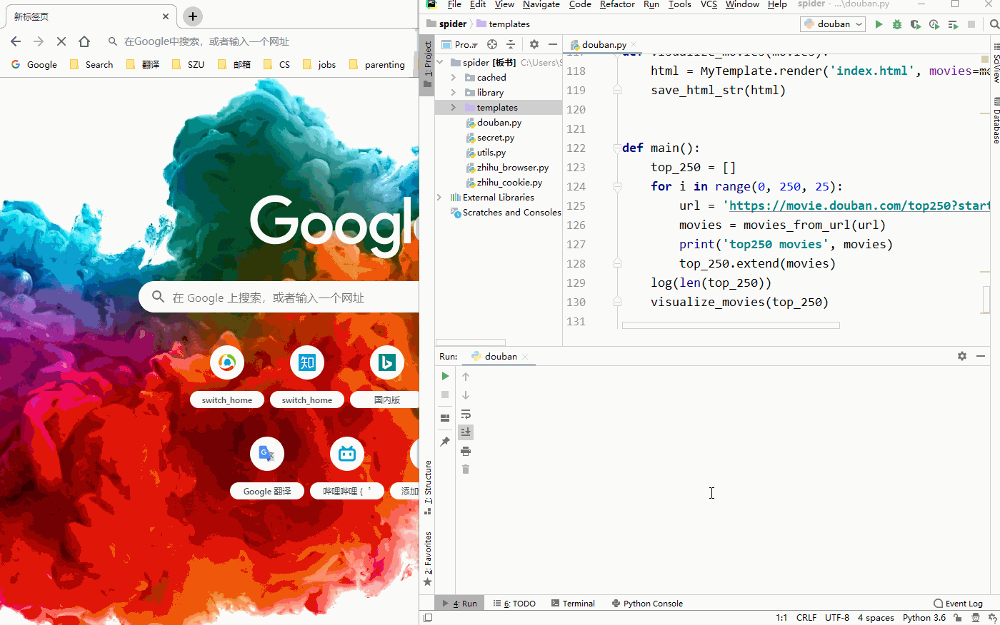

Spider 高效爬虫实践
===

演示
---

- 豆瓣电影 Top 250 爬取并进行结果可视化:
  - 

- 浏览器下拉行为模拟 + cookie 伪造登录, 爬取知乎动态刷新内容
  - 

功能
---
- 根据爬取数据特性建 Model 聚集数据, 方便后续高效利用
- 爬取多页面 
- 页面缓存提升效率及可靠性 
- 浏览器行为模拟爬取动态页面 
- cookie 身份验证, 爬取保护内容 
- 利用 jinja2 渲染出可视化的结果

使用方法
---
- 豆瓣 250:
  - 运行 douban_visual.py
  - 在浏览器打开生成的 visualising.html
- 知乎:
  - 补上 serect.py 于根目录, 放自己的知乎 cookie (在浏览器直接复制粘贴即可)
    - 格式为: cookie = 'k=v;k=v;...'
  - 执行
